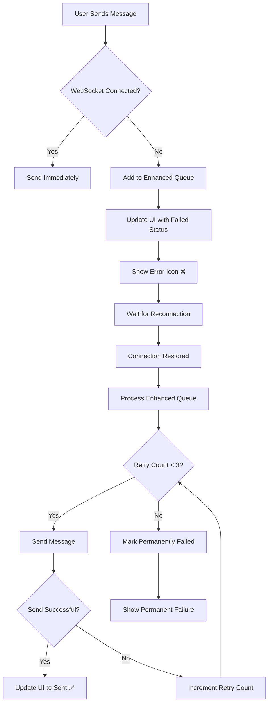

# WebSocket Message Queue Implementation

## Overview

This document describes the enhanced WebSocket message queue functionality implemented to handle network disconnections (such as when the camera opens) and ensure reliable message delivery in the HiChat app.

## 🎯 **Problem Statement**

When users open the camera to capture photos or videos, the network connection often gets interrupted, causing the WebSocket to disconnect. This resulted in:
- ❌ Lost messages when the camera was active
- ❌ No indication to users that messages failed to send
- ❌ Poor user experience with missing messages
- ❌ No automatic retry mechanism

## ✅ **Solution: Enhanced Message Queue System**

### **Key Features**

#### **1. Intelligent Message Queuing**
- **Automatic Detection**: Detects WebSocket disconnections and queues messages
- **Message Tracking**: Each message gets a unique ID for status tracking
- **Metadata Preservation**: Maintains full message context and payload
- **Queue Persistence**: Messages remain queued until successfully sent

#### **2. Visual Status Indicators**
- **Failed Status**: Messages show with error icon (❌) when queued
- **Automatic Updates**: Status updates when messages are sent from queue
- **Real-time Feedback**: Users see immediate feedback about message status

#### **3. Automatic Retry System**
- **Connection Recovery**: Automatically sends queued messages when reconnected
- **Retry Logic**: Up to 3 automatic retry attempts per message
- **Batch Processing**: Efficiently processes multiple queued messages
- **Rate Limiting**: Prevents server overload with controlled message rate

#### **4. Robust Error Handling**
- **Permanent Failure Detection**: Marks messages as permanently failed after max retries
- **Graceful Degradation**: Continues operation even with network issues
- **User Notifications**: Clear feedback about message status

## 🏗️ **Technical Implementation**

### **Core Components**

#### **1. QueuedMessage Class**
```dart
class QueuedMessage {
  final String id;           // Unique message identifier
  final String chatId;       // Target chat ID
  final Map<String, dynamic> payload;  // Complete message payload
  final DateTime queuedAt;   // Timestamp when queued
  final int retryCount;      // Number of retry attempts
  final String type;         // Message type (send, update, delete)
}
```

#### **2. Enhanced WebSocket Service**
```dart
class ChatWebSocketService {
  // Enhanced queuing structures
  final List<QueuedMessage> _enhancedMessageQueue = [];
  final Map<String, QueuedMessage> _pendingMessages = {};
  
  // Legacy simple queue (for backward compatibility)
  final List<String> _messageQueue = [];
}
```

### **Queue Processing Flow**



### **Key Methods**

#### **Enhanced Sending with Queue Support**
```dart
void _sendJson(Map<String, dynamic> json, {String? messageId, String? chatId}) {
  if (_isConnected && _webSocket != null) {
    // Send immediately
    _webSocket!.sink.add(jsonEncode(json));
    _pendingMessages.remove(messageId);
  } else {
    // Queue with enhanced tracking
    final queuedMessage = QueuedMessage(
      id: messageId ?? _generateTempId(),
      chatId: chatId ?? 'unknown',
      payload: json,
      queuedAt: DateTime.now(),
      type: json['action']?.toString() ?? 'unknown',
    );
    
    _enhancedMessageQueue.add(queuedMessage);
    _pendingMessages[messageId!] = queuedMessage;
    _notifyMessageQueuedStatus(messageId, chatId!);
  }
}
```

#### **Queue Processing on Reconnection**
```dart
void _processEnhancedMessageQueue() {
  final List<QueuedMessage> failedMessages = [];
  
  while (_enhancedMessageQueue.isNotEmpty) {
    final queuedMessage = _enhancedMessageQueue.removeAt(0);
    
    try {
      // Send the queued message
      final jsonMessage = jsonEncode(queuedMessage.payload);
      _webSocket?.sink.add(jsonMessage);
      
      // Update status to sending
      _notifyMessageSentFromQueue(queuedMessage);
      
      // Small delay to prevent server overload
      if (_enhancedMessageQueue.isNotEmpty) {
        Future.delayed(const Duration(milliseconds: 100));
      }
      
    } catch (e) {
      // Handle retry logic
      if (queuedMessage.retryCount < 3) {
        failedMessages.add(queuedMessage.copyWithRetry());
      } else {
        _notifyMessagePermanentlyFailed(queuedMessage);
      }
    }
  }
  
  // Re-add failed messages for retry
  _enhancedMessageQueue.addAll(failedMessages);
}
```

## 📱 **User Experience**

### **Message Status Indicators**

| Status | Icon | Description | User Action |
|--------|------|-------------|-------------|
| **Sending** | ⏳ | Message being sent | Wait |
| **Sent** | ✅ | Successfully sent | None |
| **Queued** | ❌ | Waiting for connection | Wait for auto-retry |
| **Failed** | ❌ | Permanently failed | Manual retry available |

### **Visual Feedback**
- **Immediate Response**: Users see messages appear instantly with appropriate status
- **Clear Indicators**: Error icons clearly show when messages are queued
- **Automatic Updates**: Status automatically updates when messages are sent
- **No Lost Messages**: All messages remain visible, even when queued

### **Network Interruption Scenarios**

#### **1. Camera Usage**
```
User opens camera → WebSocket disconnects → Messages queued with ❌
Camera closes → WebSocket reconnects → Queued messages sent automatically ✅
```

#### **2. Poor Network Conditions**
```
Network drops → Messages queue with ❌ → Network recovers → Auto-retry succeeds ✅
```

#### **3. Server Maintenance**
```
Server offline → Messages queue with ❌ → Server returns → Batch send with delays
```

## 🔧 **Configuration & Control**

### **Queue Management Methods**

#### **Status Checking**
```dart
// Check if message is queued
bool isQueued = ChatWebSocketService.instance.isMessageQueued(messageId);

// Get queue count
int queueCount = ChatWebSocketService.instance.queuedMessageCount;

// Get queued messages for specific chat
List<QueuedMessage> chatQueue = ChatWebSocketService.instance
    .getQueuedMessagesForChat(chatId);
```

#### **Manual Control**
```dart
// Manually retry specific message
ChatWebSocketService.instance.retryQueuedMessage(messageId);

// Clear entire queue (use with caution)
ChatWebSocketService.instance.clearMessageQueue();
```

### **Retry Configuration**
```dart
class ChatWebSocketService {
  static const int _maxRetries = 3;           // Maximum retry attempts
  static const int _retryDelayMs = 100;       // Delay between messages
  static const int _reconnectDelayMs = 5000;  // Reconnection attempt delay
}
```

## 📊 **Performance Optimizations**

### **Efficient Queue Processing**
- **Batch Processing**: Processes multiple messages in sequence
- **Rate Limiting**: 100ms delay between messages to prevent server overload
- **Memory Management**: Removes processed messages from memory
- **Connection Pooling**: Reuses existing WebSocket connection

### **Smart Retry Logic**
- **Exponential Backoff**: Could be implemented for retry delays
- **Priority Queuing**: Could prioritize certain message types
- **Duplicate Detection**: Prevents duplicate message sending
- **Queue Size Limits**: Could implement max queue size if needed

## 🛡️ **Error Handling**

### **Connection States**
```dart
enum ConnectionState {
  connected,    // Normal operation
  disconnected, // Queuing active
  connecting,   // Reconnection in progress
  failed,       // Connection failed permanently
}
```

### **Message States**
```dart
enum MessageStatus {
  sending,    // Currently being sent
  sent,       // Successfully sent
  delivered,  // Delivered to recipient
  read,       // Read by recipient
  failed,     // Failed to send (queued or permanently failed)
}
```

### **Error Recovery**
- **Automatic Reconnection**: Attempts to reconnect every 5 seconds
- **Progressive Delays**: Increases delay between reconnection attempts
- **Connection Validation**: Validates connection before processing queue
- **Graceful Degradation**: Continues to queue messages even during failures

## 🔍 **Debugging & Monitoring**

### **Debug Logging**
```dart
debugPrint('$_tag: WebSocket disconnected, queuing message');
debugPrint('$_tag: Sent queued message $messageId (${queuedMessage.type})');
debugPrint('$_tag: Failed to send queued message $messageId: $e');
```

### **Queue Statistics**
- **Queue Size**: Current number of queued messages
- **Retry Counts**: Track retry attempts per message
- **Success Rate**: Monitor successful queue processing
- **Connection Uptime**: Track connection stability

## 🚀 **Benefits**

### **User Experience**
- ✅ **No Lost Messages**: All messages are preserved and eventually sent
- ✅ **Clear Feedback**: Users always know message status
- ✅ **Seamless Operation**: Works transparently in background
- ✅ **Reliable Delivery**: Messages are eventually delivered when connection restored

### **Technical Benefits**
- ✅ **Fault Tolerance**: Handles network interruptions gracefully
- ✅ **Automatic Recovery**: No manual intervention required
- ✅ **Scalable**: Can handle multiple queued messages efficiently
- ✅ **Maintainable**: Clean separation of concerns and clear interfaces

### **Business Value**
- ✅ **Improved Retention**: Users don't lose messages due to network issues
- ✅ **Better Trust**: Reliable message delivery builds user confidence
- ✅ **Reduced Support**: Fewer user complaints about lost messages
- ✅ **Professional Experience**: Matches expectations from modern messaging apps

## 📱 **Camera Integration**

### **Specific Camera Handling**
When users open the camera:

1. **Pre-Camera**: WebSocket connected, messages send normally
2. **Camera Opens**: Network may disconnect, WebSocket drops
3. **Message Sent**: Automatically detected as queued, shows ❌ status
4. **Camera Closes**: Network restored, WebSocket reconnects
5. **Auto-Recovery**: Queued messages automatically sent, status updates to ✅

### **Media Message Queuing**
- **Upload Progress**: Preserved across disconnections
- **File References**: Maintained in queue with full metadata
- **Thumbnail Data**: Cached locally and sent when connected
- **Large Files**: Handled efficiently with proper retry logic

## 🔮 **Future Enhancements**

### **Potential Improvements**
- **Priority Queuing**: Important messages sent first
- **Selective Retry**: Different retry strategies per message type
- **Offline Persistence**: Save queue to local storage for app restarts
- **Compression**: Compress large message payloads in queue
- **Analytics**: Track queue performance and network patterns

### **Advanced Features**
- **Message Bundling**: Group related messages for efficiency
- **Smart Reconnection**: Use device connectivity APIs for smarter reconnection
- **Background Sync**: Continue sending when app is backgrounded
- **Push Notifications**: Notify when queued messages are sent

This implementation provides a robust, user-friendly solution for handling network disconnections while maintaining excellent user experience and reliable message delivery.